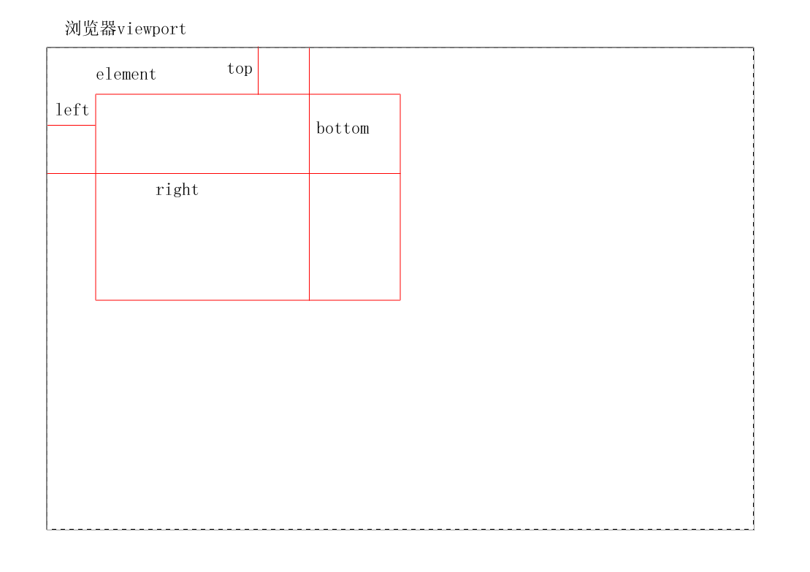

## Element.getBoundingClientRect()
返回一个DOMRect对象，此对像包含top、bottom、left、right、width、height等属性，其中top、bottom、left、right的值是指目标元素的上边框距离浏览器viewport上边框的距离、元素下边框距离浏览器viewport上边框的距离、元素左边框距离浏览器viewport左边框的距离、元素右边框距离浏览器viewport左边框的距离。即此四个属性只是分别相对于浏览器viewport的左边框和上边框，而不是四个边框。

## Element.offsetHeight
offsetHeight = height + padding + border + horizontal scrollbar (if 
present)

* it doesn't include the height of pseduo-elements such as :before or
:after.

* round the value to integer.

## Element.clientHeight
clientHeight = height + padding - height of horizontal scrollbar (if present)

* round the value to integer.

## Element.scrollHeight
scrollHeight = height + padding - height of horizontal scrollbar (if
present)

* the height is mesured in the same way as the clientHeight.

* it can also include the pseduo-elements such as :before or :after.

* if the element's content can fit without a need for vertical scrollbar, its scrollHeight is equal to clientHeight.
